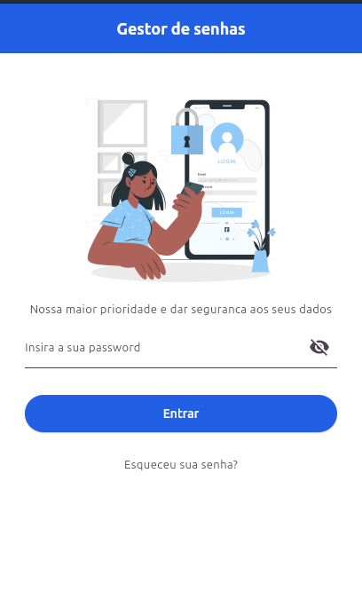
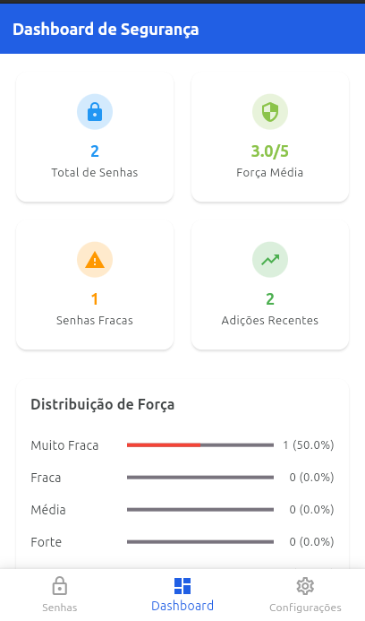
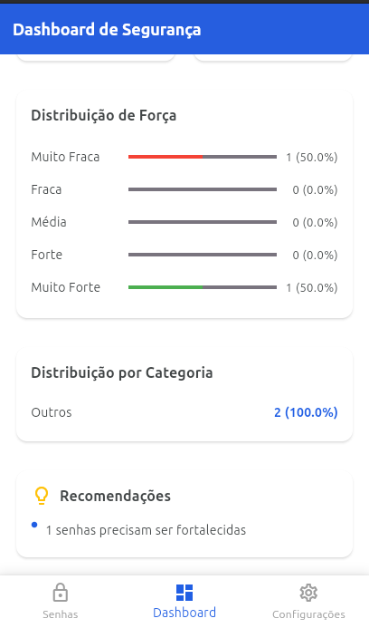
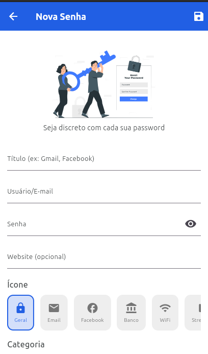
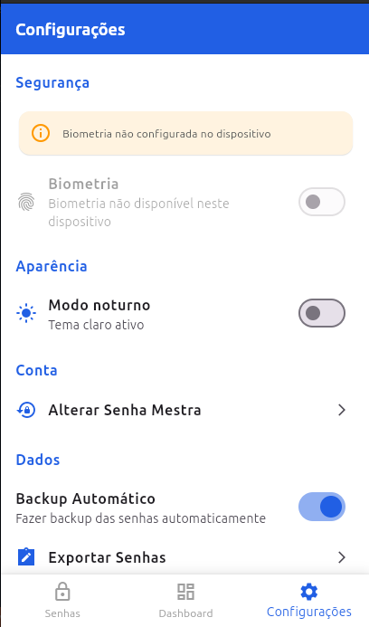
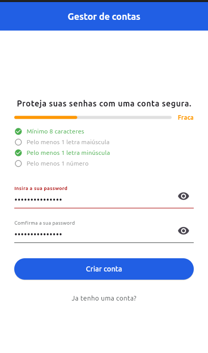

# 🔐 SecureVault - Gestor de Senhas em Flutter


**Um gestor de senhas seguro e elegante com encriptação local e biometria**

## 🚀 Sobre o Projeto

O **SecureVault** é uma aplicação completa de gestão de senhas que demonstra práticas avançadas de desenvolvimento Flutter, segurança de dados e UX moderna.

### ✨ Funcionalidades Principais

- 🔐 **Senha Mestra** - Acesso seguro com autenticação única
- 🎨 **Tema Claro/Escuro** - Com persistência automática
- 👆 **Autenticação Biométrica** - Face ID e Fingerprint
- 💾 **Armazenamento Seguro** - Hive + Secure Storage
- 📊 **Dashboard Inteligente** - Estatísticas em tempo real
- 🔍 **Busca e Filtros** - Encontre senhas rapidamente
- 🛡️ **Encriptação AES-256** - Proteção avançada
- 📱 **UI Moderna** - Bottom Navigation e gestos

## 🛠️ Tecnologias Utilizadas

- **Flutter 3.19** - Framework UI
- **Dart 3.0** - Linguagem de programação
- **Hive 2.2** - Base de dados local
- **SharedPreferences** - Configurações
- **flutter_secure_storage** - Credenciais seguras
- **local_auth** - Autenticação biométrica
- **encrypt** - Encriptação AES-256

## 📁 Estrutura do Projeto
```text

lib/
├── main.dart
├── models/
│ └── password_item.dart
├── pages/
│ ├── welcome_screen.dart
│ ├── login_master_screen.dart
│ ├── create_master_screen.dart
│ ├── main_screen.dart
│ ├── add_password_screen.dart
│ ├── dashboard_screen.dart
│ └── settings_screen.dart
├── services/
│ ├── encryption_service.dart
│ ├── secure_storage_service.dart
│ └── biometric_service.dart
├── repositories/
│ └── password_repository.dart
└── ui/
└── themes.dart

```


## 🎯 Funcionalidades Detalhadas

### Gestão de Senhas
- Adicionar, editar, excluir senhas
- Organização por categorias
- Ícones personalizados
- Força da senha calculada automaticamente
- Busca em tempo real

### Segurança
- Encriptação AES-256
- Senha mestra protegida
- Autenticação biométrica opcional
- Dados 100% locais
- Cópia segura para clipboard

### Dashboard & Analytics
- Total de senhas guardadas
- Força média das senhas
- Distribuição por categorias
- Identificação de senhas fracas
- Recomendações de segurança

## 🔐 Sistema de Segurança

### Fluxo de Encriptação
```dart
// Encriptar ao guardar
String encrypted = EncryptionService.encrypt(password);

// Desencriptar ao mostrar  
String decrypted = EncryptionService.decrypt(encryptedPassword);
```

## Armazenamento
- Hive → Senhas (encriptadas)

- Secure Storage → Senha mestra

- SharedPreferences → Configurações UI

## 🚀 Como Executar
1. Clone e instale dependências
   ```bash
   git clone https://github.com/seu-usuario/securevault.git
   cd securevault
   flutter pub get
   ```
2. Clone e instale dependências
   ```bash
   flutter pub run build_runner build
   ```

3. Execute a aplicação

   ```bash
   flutter run
   ```
## 📱 Capturas de Tela

|Tela de Login|Dashboard|Gestão de Senhas|
|---|---|---|
||||

|Adicionar Senha|Configurações|Cadastro|
|---|---|---|
||||

## 🔮 Próximas Funcionalidades

- Backup & Restore
- Sincronização Cloud
- Gerador de Senhas avançado
- Partilha segura
- Auditoria de segurança
- Widget para Home Screen
    

## 👨‍💻 Desenvolvido por

**Leovigildo** - _Desenvolvedor Flutter_

## 📄 Licença

Este projeto está sob a licença MIT. Veja o arquivo [LICENSE](https://license/) para mais detalhes.

---

<div align="center">

### 🛡️ _"A segurança não é um produto, mas um processo contínuo"_

**SecureVault - Mantenha suas senhas seguras, sempre.**

</div>